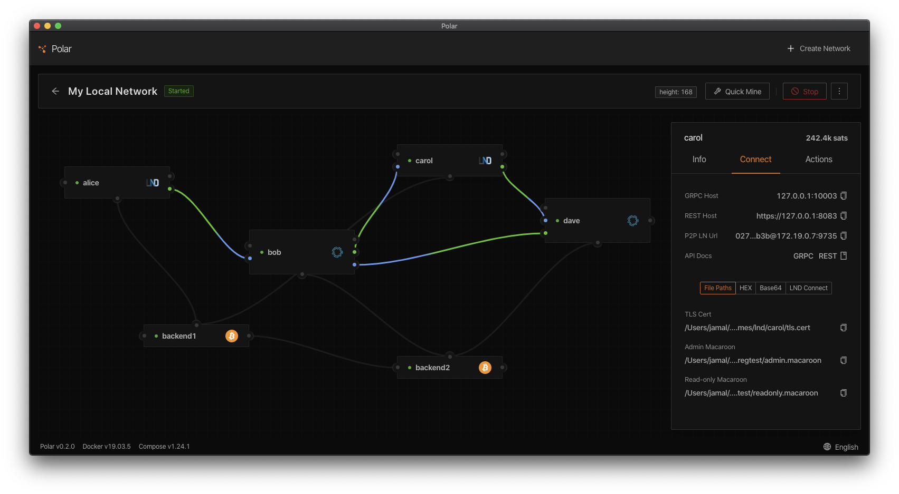

# Polar

> One-click Bitcoin Lightning networks for local app development & testing

  
  <a href="https://youtu.be/mb37durvPns" target="_blank">
    View a short video demo
  </a>

## Purpose

Polar was built to help Lightning Network application developers quickly spin up one or more networks locally on their computers.

With Polar you can:

- Create a regtest Lightning Network in just a few clicks
- Connect from your app to the lightning nodes via RPC
- Add more nodes using drag & drop
- Start and stop individual nodes
- Open & Close Channels
- Create & Pay Lightning Invoices
- Launch a terminal in each bitcoin/lightning node
- View streaming logs from each node
- Manually mine new blocks
- Deposit regtest coins into each Lightning node
- Mint, Send & Receive Taproot Assets
- Create & Pay Taproot Asset invoices
- Export and import networks, for sharing with other Lightning developers
- Create you own docker images to use as [custom nodes](https://github.com/jamaljsr/polar/blob/master/docs/custom-nodes.md) (ex: master branch, local fork)

Supported Network Node Versions:

- [LND](https://github.com/lightningnetwork/lnd) - v0.18.4, v0.18.3, v0.17.5, v0.16.4
- [Core Lightning](https://github.com/ElementsProject/lightning) - v24.11, v24.08, v24.05
- [Eclair](https://github.com/ACINQ/eclair/) - v0.11.0, v0.10.0, v0.9.0
- [Bitcoin Core](https://github.com/bitcoin/bitcoin) - v28.0, v27.0, v26.0
- [Taproot Assets](https://github.com/lightninglabs/taproot-assets) - v0.5.0, v0.4.1, v0.3.3
- [Terminal](https://github.com/lightninglabs/lightning-terminal) - v0.14.0

## Dependencies

Polar requires that you have Docker installed to create the local networks

- On Mac & Windows, you can just install [Docker Desktop](https://www.docker.com/products/docker-desktop)
- On Linux, you need to install [Docker Server](https://docs.docker.com/engine/install/#server).

You will be prompted to install Docker if Polar cannot detect it automatically

⚠️ **Important Docker Notes**

- On Linux, Docker Desktop is currently not supported due to a significant change in how it handles file sharing between host and container (See [#636](https://github.com/jamaljsr/polar/issues/636#issuecomment-1450201391))

## Download

Download Polar v3.2.0 for your OS

- Mac ([dmg](https://github.com/jamaljsr/polar/releases/download/v3.2.0/polar-mac-x64-v3.2.0.dmg))
- Linux ([deb](https://github.com/jamaljsr/polar/releases/download/v3.2.0/polar-linux-amd64-v3.2.0.deb), [AppImage](https://github.com/jamaljsr/polar/releases/download/v3.2.0/polar-linux-x86_64-v3.2.0.AppImage)), [RPM](https://github.com/jamaljsr/polar/releases/download/v3.2.0/polar-linux-x86_64-v2.1.0.rpm))
- Windows ([exe](https://github.com/jamaljsr/polar/releases/download/v3.2.0/polar-win-x64-v3.2.0.exe))

Alternative and older version binaries can be found in the [GitHub releases](https://github.com/jamaljsr/polar/releases)

## Help Translate

Polar's translations are managed on [Crowdin](https://crowdin.com/project/polar). The initial translations of 10 languages were done by machine (Google Translate) and are likely to not be 100% accurate. If you speak multiple languages and wish to help with translations, please feel free to head over to the [project page](https://crowdin.com/project/polar) on Crowdin and submit updated strings. This assistance would be greatly appreciated.

## Development

If you would like to learn how to package Polar from source code or want to fix a bug or add a new feature, please see [CONTRIBUTING](https://github.com/jamaljsr/polar/blob/master/CONTRIBUTING.md) for detailed instructions.

### Commands

| Command         | Description                                                       |
| --------------- | ----------------------------------------------------------------- |
| `yarn`          | install dependencies                                              |
| `yarn dev`      | run the app with react hot reloading and electron live restarting |
| `yarn test`     | run unit tests in watch mode                                      |
| `yarn test:e2e` | run e2e tests                                                     |
| `yarn lint:all` | run typescript and eslint syntax checking                         |
| `yarn package`  | package the app for your OS                                       |

### Tech Stack

- [Node.js](https://nodejs.org/en): nodejs version >= 20
- [Electron](https://github.com/electron/electron/): cross platform desktop app framework
- [Typescript](https://github.com/microsoft/TypeScript): increased productivity with a typed language
- [ReactJS](https://github.com/facebook/react/): declarative UI library for JavaScript
- [Create React App](https://github.com/facebook/create-react-app): minimize build configuration
- [easy-peasy](https://github.com/ctrlplusb/easy-peasy): Redux state management without the boilerplate
- [Emotion](https://emotion.sh/): simplified CSS style composition
- [Ant Design](https://github.com/ant-design/ant-design/): don't reinvent the wheel with UI design
- [react-i18next](https://github.com/i18next/react-i18next): support for multiple languages (english/spanish included)
- [electron-log](https://github.com/megahertz/electron-log): multi-level logging to console and file
- [Prettier](https://github.com/prettier/prettier): keep code format consistent
- [ESLint](https://github.com/eslint/eslint): follow code quality best practices
- [Github Actions](https://github.com/actions): automate builds and testing on Windows/Mac/Linux
- [Renovate Bot](https://github.com/renovatebot/renovate): automate dependency upgrades via GitHub bot
- [Jest](https://github.com/facebook/jest): delightful JavaScript testing
- [React Testing Library](https://github.com/testing-library/react-testing-library): React specific testing utilities
- [CodeCov](https://codecov.io/): maintain quality of unit tests
- [Testcafe](https://github.com/DevExpress/testcafe): End-to-end is important
- [commitlint](https://github.com/conventional-changelog/commitlint): standardize git commit messages
- [standard-version](https://github.com/conventional-changelog/commitlint): automate release versioning and changelog generation
